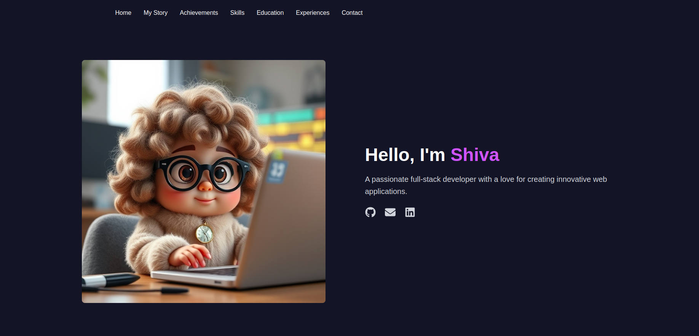

# Shiva Moeini - Personal Portfolio Template

A clean and modern template for showcasing your skills, experience, and achievements.  Built with React, Next.js, and Tailwind CSS.



This project is a personal portfolio template designed to help developers and other professionals create a beautiful and effective online presence.  It features a responsive design, a clean codebase, and customizable components.


## Key Features

*   **React, Next.js, Tailwind CSS:** Modern tech stack for performance and customization.
*   **Responsive Design:** Looks great on all devices.
*   **Easy Customization:**  Quickly personalize with detailed component instructions.


## Getting Started

Follow these steps to set up and run this template locally.

### Prerequisites

Make sure you have the following installed:

*   **Node.js:** (Ideally the latest LTS version. Check with `node -v`) Download from [https://nodejs.org/](https://nodejs.org/)
*   **npm:** (Comes with Node.js) Check with `npm -v`
*   **Git:** (Optional, but recommended for version control) Download from [https://git-scm.com/](https://git-scm.com/)

### Installation

1.  **Clone the repository:**

    ```bash
    git clone https://github.com/Shiva-Moeini/My-Website
    cd  About-Me 
    ```

2.  **Install dependencies:**

    ```bash
    npm install
    ```

3.  **Run the development server:**

    ```bash
    npm run dev
    ```

4.  **Open your browser and navigate to `http://localhost:3000` to see the application running.**

##  Customization

Here's how to customize the different sections of your portfolio:


*   **Content Customization:**
    *   **Home Section (Me Component):** Edit the `Me.js` file in the `/src/app/components/Me/` directory to change your name, bio, image, and social links.
    *   **My Story Section (MyStory Component):** Edit the `MyStory.js` file in the `/src/app/components/MyStory/` directory to change the title and story text. The `page.js` file shows how the `storyText` is formatted.
    *   **Achievements Section (Achievements Component):**  Edit the `Achievements.js` and `AchievementCard.js` files in the `/src/app/components/Achievements/` directory to add, remove, or modify achievements.
    *   **Skills Section (Skills Component):** Edit the `Skills.js` and `SkillItem.js` files in the `/src/app/components/Skills/` directory to update your skills.
    *   **Education Section (Education Component):** Edit the `Education.js` and `EducationItem.js` files in the `/src/app/components/Education/` directory to list your education history.
    *   **Experience Section (Experience Component):** Edit the `Experience.js` and `ExperienceItem.js` files in the `/src/app/components/Experience/` directory to list your work experience.
    *   **Contact Section (Contact/Footer Component):** Edit the `Contact.js` file in the `/src/app/components/Contact/` directory to change the connect message and social links.
*   **Navigation (Nav Component):**
    *   Edit the `Nav.js` file in the `/src/app/components/Nav/` directory to change the navigation links. The `page.js` file passes the `navLinks` array as a prop.
*   **Images:**
    *   Replace `/public/d.jpeg` with your own image file. Remember to update the `imageSrc` property in `page.js` within the `userData` object.
*   **Adding/Removing Sections:**
    *   To add a new section, create a new component in the `components` directory and import it into `page.js`.
    *   To remove a section, simply remove the corresponding component import and JSX element from `page.js`.
*   **Changing fonts.**
    *   To add the fonts that you want to use edit the `layout.js` file located inside `src/app`

##  Deployment

This project is easily deployable to Vercel:

1.  Create a Vercel account (if you don't already have one).
2.  Import your project from your Git repository into Vercel.
3.  Vercel will automatically detect the Next.js project and configure the deployment.

You can also deploy to other platforms such as Netlify or AWS. See the Next.js documentation for more details.


##  Contact

<Shiva Moeini> - <shiva.moeini20@gmail.com> - <https://github.com/Shiva-Moeini> - <https://www.linkedin.com/in/shivamoeini/>

---

**Notes:**

*   This template uses [React Icons](https://react-icons.github.io/react-icons/) and [Font Awesome](https://fontawesome.com/) for icons.  Explore their documentation for more options.
*   The main page is `page.js` inside the `app` folder.